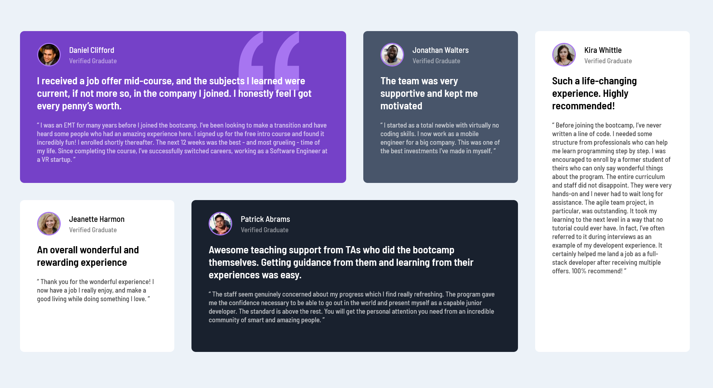

# Frontend Mentor - Testimonials grid section solution

This is a solution to the [Testimonials grid section challenge on Frontend Mentor](https://www.frontendmentor.io/challenges/testimonials-grid-section-Nnw6J7Un7). Frontend Mentor challenges help you improve your coding skills by building realistic projects. 

## Table of contents

- [Overview](#overview)
  - [The challenge](#the-challenge)
  - [Screenshot](#screenshot)
  - [Links](#links)
- [My process](#my-process)
  - [Built with](#built-with)
- [Author](#author)
**Note: Delete this note and update the table of contents based on what sections you keep.**

## Overview

### The challenge

Users should be able to:

- View the optimal layout for the site depending on their device's screen size

### Screenshot

### Links

- Solution URL: [https://www.frontendmentor.io/solutions/just-a-little-grid-and-flex-6s2h1XAVR](https://your-solution-url.com)
- Live Site URL: [https://silly-bartik-3453a6.netlify.app/](https://your-live-site-url.com)

## My process

### Built with

- HTML5
- Sass
- Flexbox
- CSS Grid

## Author

- Frontend Mentor - [@mattyd96](https://www.frontendmentor.io/profile/mattyd96)
